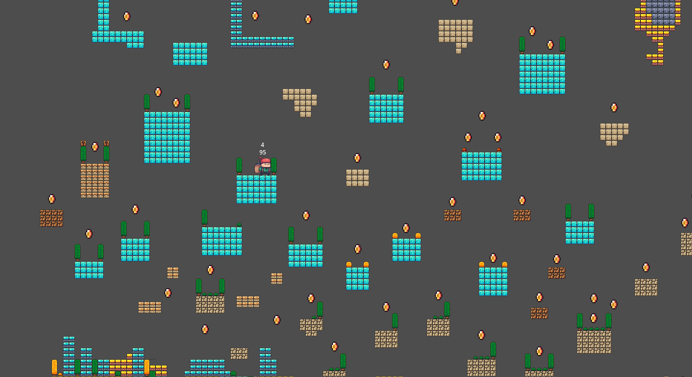

🎮 CuyRun Game Project

CuyRun adalah game platformer sederhana yang terinspirasi dari gaya permainan Cat Mario, dikembangkan menggunakan Godot Engine. Project ini dibuat sebagai bagian dari proses belajar dan eksplorasi dalam pengembangan game, khususnya dalam mekanik gameplay, interaksi objek, dan logika pemrograman.

👨‍💻 Developer: Muhammad Reki
🚀 Fokus: Game Development & Software Engineering
🧠 Tech Stack: Godot Engine, GDScript

✨ Fitur:

* Sistem koin interaktif
* Mekanik platformer (lompat, gerak, dll)
* Sistem logika berbasis event
* UI sederhana untuk menampilkan skor

📌 Tujuan Project:
Mengembangkan kemampuan dalam pembuatan game 2D serta memahami alur kerja pengembangan software secara praktis.

🔥 Status:
Masih dalam tahap pengembangan dan akan terus di-update dengan fitur baru.

📸 Dokumentasi Game

